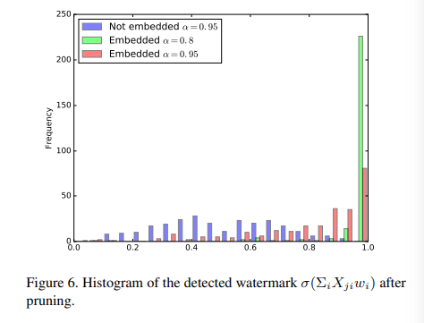

Embedding-Watermarks-into-Deep-Neural-Networks导读与复现

**Abstract：** Significant progress has been made with deep neural networks recently. Sharing trained models of deep neural networks has been a very important in the rapid progress of research and development of these systems. At the same time, it is necessary to protect the rights to shared trained models. To this end, we propose to use digital watermarking technology to protect intellectual property and detect intellectual property infringement in the use of trained models. First, we formulate a new problem: embedding watermarks into deep neural networks. We also define requirements, embedding situations, and attack types on watermarking in deep neural networks. Second, we propose a general framework for embedding a watermark in model parameters, using a parameter regularizer. Our approach does not impair the performance of networks into which a watermark is placed because the watermark is embedded while training the host network. Finally, we perform comprehensive experiments to reveal the potential of watermarking deep neural networks as the basis of this new research effort. We show that our framework can embed a watermark during the training of a deep neural network from scratch, and during fine-tuning and distilling, without impairing its performance. The embedded watermark does not disappear even after fine-tuning or parameter pruning; the watermark remains complete even after 65% of parameters are pruned.

**abstract of the abstract:** 

* 将一个水印编入神经网络中很有意义，很有前景（废话）。
* 我们通过用parameter regularizer进行水印的编入，这对网络的性能没有影响（重要）。
* 我们做了实验，实验效果很好。

## introduction

训练模型时间会很长，现在有许多finetuning和trasferlearning的方法，未来模型会跟视频图片等一样会有商业价值。本文第一次尝试将水印加入模型。研究主要有三个contributions.

* 公式化了一个新问题，将水印加入DNN，同时定义了需求，场景和攻击类型
* 我们提出了一个普遍的框架（或者说是一个普遍的方法）通过一个parameter regularizer去加入水印，并且这个水印不影响模型的效果。
* 我们做了些实验。

## problem formulation

一些定义：

task: 加入一个 **T** bit的0/1向量 $b\in \{0,1\}^T$ 到网络模型中。被加入水印的模型叫 **host network** ，之前的模型任务叫做 **original task**。

接下来根据introduction我们定义需求场景和攻击类型。

#### 需求：

将模型水印和视频水印进行类比，面对finetuning和transfer learning的模型修改方式要又不变性。

#### 编入水印的场景：

* 训练时编入（从头训练刚开始就编入）
* finetune时编入（网络已经被pretrain过，只有靠近输出层的参数会改变）
* distill编入(distill framework:通过先训练一个大网络再通过大网络的结果训练小网络实现模型压缩)

前两种场景都可以加入私人的水印，但最后一种需要一个可信任平台加入水印。

### 可能的攻击

* fine-tuning or transfer-learning
* model compression

## proposed framework

用DCNN进行实验

### embedding targets

本文中假设将水印编入一个卷积层中，其中(S, S): filter size , D: depth of input to the layer, L: number of filters。这个卷积层参数就是 $W \in R^{S*S*D*L}$ （这里忽略了bias）。这里filter的顺序不应该影响谁赢embed的结果，所以我们对W在L上取平均得到 $w \in R^{M},M=S*S*D$ 。所以embedding目标是将T-bit的b嵌入到w中。

### embedding regularizer

在原有cost function $E(w)$中加入一个正则项 $E_R(w)$ 并不会影响结果只是在w上加入了一些统计上的偏差，所以我们提出了一种正则项能嵌入水印。

首先要给定b和一个T*M的参数矩阵X。

定义:
$$
E_R = -\sum_{j=1}^T (b_j log(y_j)+(1-b_j)log(1-y_j))
$$
其中：
$$
y = \sigma(\sum_i X_{ji}w_i),\sigma (x)= \frac{1}{1+exp(-x)}
$$
将这个正则项加入Loss就能使y接近b，在验证的时候只需计算 $s(\sum_i X_{ji}w_i)$ 与 $b_j$ 进行对比即可，其中 s= x>=0 ? 1:0;(不想打latex就用c写了....)

这样就能通过正则项嵌入水印了。

### regularizer parameters

讨论了各种X的取值方法，主要又三种: $X^{direct},X^{diff},X^{random}$ 具体细节可以去看文章，但文章做了实验发现最后一种效果最好，最后也只用了最后一种X进行了后续实验，所以只讲解 $X^{random}$，其实就是一个X的每个元素通过(0,1)正太分布的独立取样得到。

## 实验

首先介绍了所用数据集、host network、所用参数(水印为全1向量、lambda取值)、水印嵌入位置等。

### test error and training loss

比较不同的X，得到loss曲线，如下图所示：

同时记录不同方法test error(%)，如下表所示：

### detecting watermarks

记录了嵌入水印后 $\sigma(\sum_i X_{ji}w_i)$ 的分布柱状图与未嵌入水印进行对比(使用不同X)：

通过分布的不同可以明显的甄别出模型是否嵌入水印。

### 模型参数分布

记录了不同X变换后模型参数的分布：

可以看出使用$X^{random}$对参数分布的影响最小，同时根据之前的结果使用其的loss也比较小，所以一般采用该X进行变换。

### Fine-tune-to-embed and Distill-to

记录了embedding在不同场景下的表现：

可以看出表现都很好，test error都很低。可见其对上述三种场景都有很好的适用性。

### Capacity of Watermark

通过加入不同大小的水印来测试容量(能加入最大而不影响效果的水印的大小)。

注意原文中有句话：

“the number of embedded bits should be smaller than the number of parameters w, which is a limitation of the embedding method using a single-layer perceptron”

这句话也很好理解。

本实验测试结果如下：

###  Embedding without Training

可以不重新训练就将水印嵌入，具体方法是重新设计E(w)：
$$
E(w) = \frac{1}{2}||w-w_0||_2^2 + \lambda E_R(w)
$$
这种设计方式也很好理解在最大程度不改变w的情况下让水印嵌入。

实验结果如下：

## Robustness of Embedded Watermarks

主要讲了一下面对不同攻击水印鲁棒性

### Robustness against Fine-tuning

面对fine-tuning效果如下：

可以看出基本不会影响水印。

### Robustness against Model Compression

主要就三张图

该图横座标是裁剪神经元的比例，Ascending和Descending表示去掉节点的规律是按其数值从大到小或从小到大的顺序进行裁剪。

该图与上图类似。

最后一个图可以看出哪怕裁剪了80%甚至95%，仍能看出其参数分布有明显的偏向，也表示了该方法鲁棒性好。

## Future Work

* 水印重写的鲁棒性
* 对不同压缩方法(本文只实验了直接裁剪pruning)的鲁棒性
* 网络态射后鲁棒性(我也不懂啥叫network morphism....)
* steganalysis的鲁棒性(我也不懂啥是steganalysis)
* fingerprinting: 类比video等，fingerprinting也是一个很好的方向去探究。
