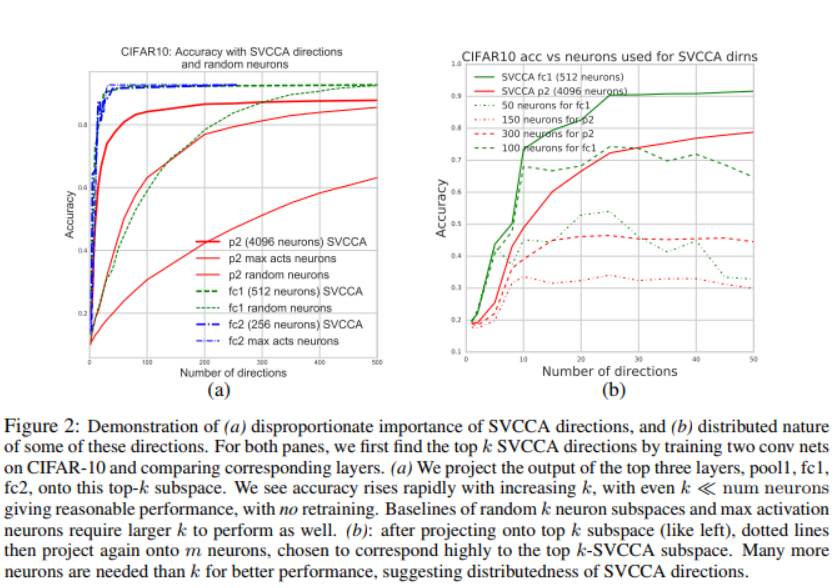
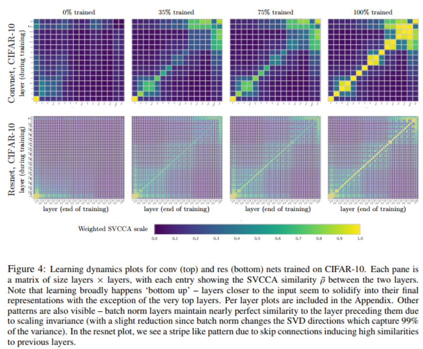
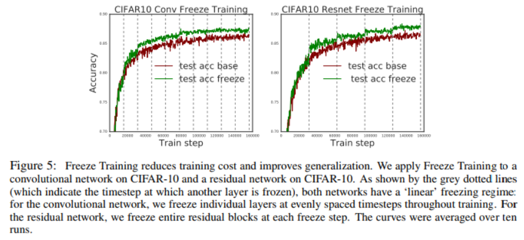
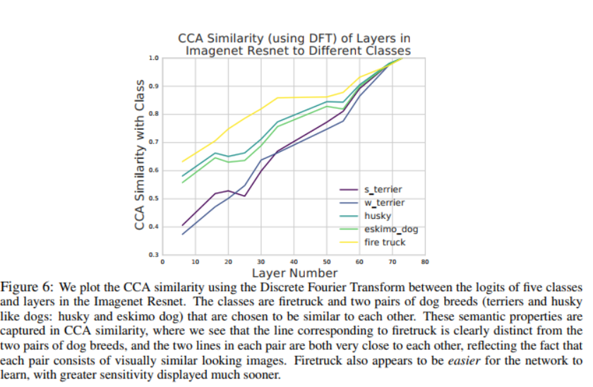
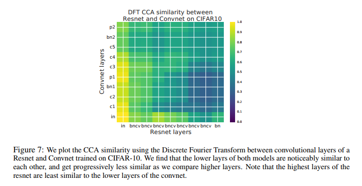
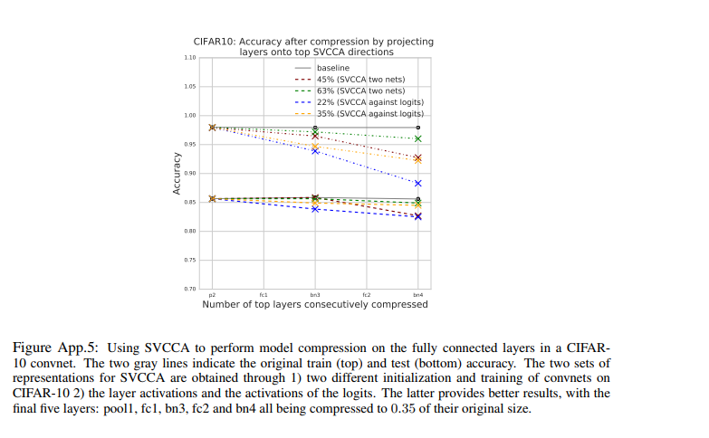
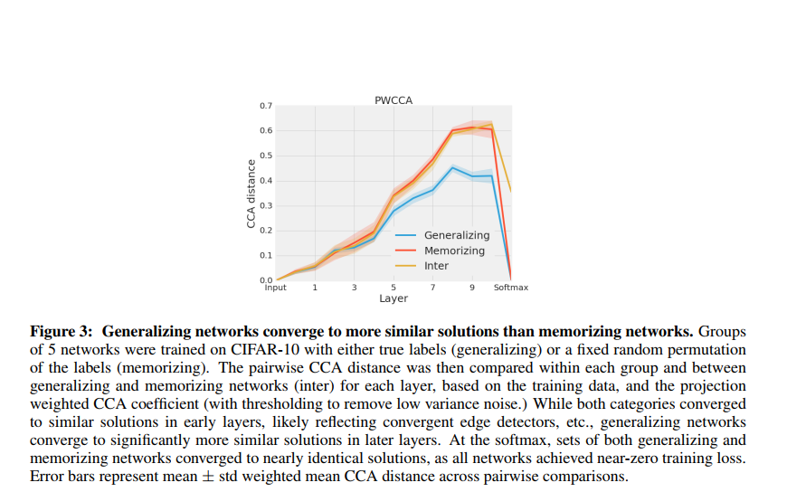
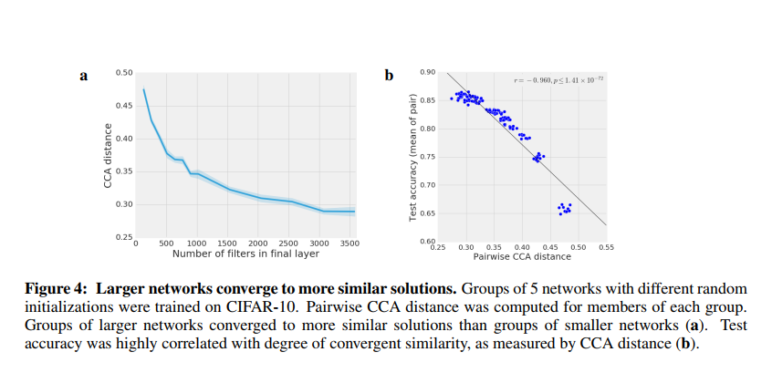
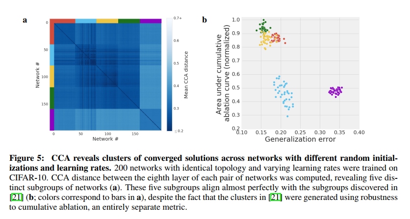
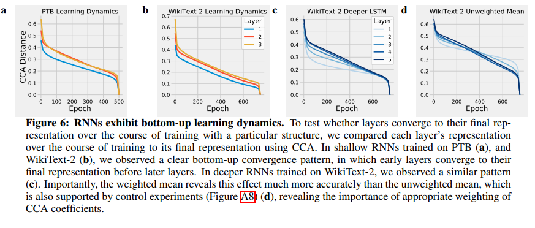

Singular Vector Canonical Correlation Analysis for Deep Learning Dynamics and Interpretability

## 数学相关知识：

### CCA(canonical correlation analysis):

典型关联分析Canonical Correlation Analysis（CCA）是一种衡量两个源于同一个潜在过程的观测集合的相关性的方法，它通过寻找最优的线性映射，将数据集每一行的 $n$ 维向量投影到一维空间中，在空间中计算两个数据集的相关性系数，将最大的相关性系数作为最终的相似度度量。

形式化上， $L_1:m_1\times n$ 和 $L_2:m_2\times n$ 是两个归一化后的矩阵，代表经过归一化处理后的两个输入的数据集。优化的目标即为
$$
\max _{w \in \mathbb{R}^{m_{1}}, s \in \mathbb{R}^{m_{2}}} \rho=\frac{\left\langle w^{T} L_{1}, s^{T} L_{2}\right\rangle}{\left\|w^{T} L_{1}\right\| \cdot\left\|s^{T} L_{2}\right\|}
$$
假设$L_1,L_2$中心化了，让$\sum_{L_i,L_j}$表示$L_i,L_j$的协方差矩阵。可解得$\Sigma_{L_{1}, L_{1}}^{-1 / 2} \Sigma_{L_{1}, L_{2}} \Sigma_{L_{2}, L_{2}}^{-1 / 2}$的(最大)奇异值即为所求。同时$u,v$为其对应的左右奇异向量，满足以下等式：
$$
w^{T} L_{1}=u^{T} \Sigma_{L_{1}, L_{1}}^{-1 / 2} L_{1}
\newline
s^{T} L_{2}=v^{T} \Sigma_{L_{2}, L_{2}}^{-1 / 2} L_{2}
$$
**推导：**

用$\sum_{L_i,L_j}$表示$L_i,L_j$的协方差矩阵，其中用高维点积代替一维乘积，上式可以有如下化简：
$$
\frac{\left\langle w^{T} L_{1}, s^{T} L_{2}\right\rangle}{\left\|w^{T} L_{1}\right\| \cdot\left\|s^{T} L_{2}\right\|}=\frac{w^{T} \Sigma_{L_{1}, L_{2}} s}{\sqrt{w^{T} \Sigma_{L_{1}, L_{1}} w} \sqrt{s^{T} \Sigma_{L_{2}, L_{2}} s}}
$$
进行基变换，令$w = \Sigma_{L_1,L_1}^{-1/2}u,s = \Sigma_{L_2,L_2}^{-1/2}v$，有
$$
\frac{w^{T} \Sigma_{L_{1}, L_{2}} s}{\sqrt{w^{T} \Sigma_{L_{1}, L_{1}} w} \sqrt{s^{T} \Sigma_{L_{2}, L_{2}} s}}
=
\frac{u^{T} \Sigma_{L_{1}, L_{1}}^{-1/2} \Sigma_{L_{1}, L_{2}} \Sigma_{L_{2}, L_{2}}^{-1/2} v}{\sqrt{u^{T} u} \sqrt{v^{T} v}}
$$
等价于如下问题：
$$
\begin{aligned}
&\max _{a \in \mathbb{R}^{m_{1}}, b \in \mathbb{R}^{m_{2}}} u^{T} \Sigma_{1,2} v \\
&\text { s.t. } \quad u^T u=1,v^T v=1
\end{aligned}
$$
其中定义$\Sigma_{1,2}$为$\Sigma_{L_{1}, L_{1}}^{-1/2} \Sigma_{L_{1}, L_{2}} \Sigma_{L_{2}, L_{2}}^{-1/2}$，且有$\Sigma_{2,1}$为其转置。

利用拉格朗日乘子法，定义：
$$
L = u^T \Sigma_{1,2} v - \frac{\lambda}{2}(u^T u -1) - \frac{\theta}{2}(v^tv-1)
$$
优化目标极值点满足：
$$
\begin{aligned}
& \frac{\partial L}{\partial u} = \Sigma_{1,2} v - \lambda u  = 0 \\
& \frac{\partial L}{\partial v} = \Sigma_{2,1} u - \theta v  = 0
\end{aligned}
$$
上面两式分别左乘$u^T,v^T$，利用限制条件$u^T u=1,v^T v=1$，可得：
$$
\lambda = \theta = u^T \Sigma_{1,2}v
$$
再次带入方程组：
$$
\begin{aligned}
&  \Sigma_{1,2} \Sigma_{2,1} u - \lambda^2 u  = 0 \\
&  \Sigma_{2,1} \Sigma_{1,2} v - \lambda^2 v  = 0
\end{aligned}
$$
可以看出，$\lambda$即为$\Sigma_{1,2}$的奇异值(也是优化目标)，$u,v$为其左、右奇异向量，故求解原问题只需将$\Sigma_{1,2}$进行奇异值分解，便能得出结论。

## intro

### main contributions:

answer several questions.

1. Q：一个隐藏层学习到的表征的维度是否跟神经元数相同？A： NO —— model compression
2. Q：深层次的表征学习动态看是怎样的？A： converge bottom up —— freeze training
3. speed up the SVCCA
4. Q：什么时候一个结构对不同类敏感？A： SVCCA captures the semantics of different classes，相似的类有相似的敏感性，反之亦然。

## Measuring Representations in Neural Networks  

### algorithm

for given dataset $X = {x_1,\cdots ,x_m}$ 和第 $l$ 层的一个神经元$i$，定义：
$$
z_i^l = (z_i^l(x_1), \cdots , z_i^l(x_m))
$$

* **INPUT:** 两个隐藏层的$z_i$，$l_1 = \{z_1^{l_1}.\cdots,z_{m_1}^{l_1}\}$ 和 $l_2 = \{z_1^{l_2}.\cdots,z_{m_2}^{l_2}\}$
* **STEP 1:** 对$l_1,l_2$ SVD分解保留99%的主成分，得到$l_1',l_2'$ 
* **STEP 2: ** 对$l_1',l_2'$ 计算CCA
* **OUTPUT: **输出线性变换后的对应向量和他们的相关系数

细节见数学相关知识。

### property

SVCCA is truly a subspace method: both SVD and CCA work with $span(z_1,\cdots, z_m)$ instead of being axis aligned to the $z_i$ directions.  

### two exp

(a) SVCCA找到的子空间对该层学习到的表征很重要。

(b) 这些找到的方向分布在各个神经元中。

### why SV + CCA is needed

CCA具有仿射不变性能实现不对齐的比较，缺点是取决于原始空间有多少重要的方向，这是SVD的强项，能够找到一个空间中重要的方向。

## SVCCA in convolutional layers

for a layer(pixel: h*w, channel: c, datapoints: d)

**same layer comparisons:** c*hwd

**different layer comparisons:** hwc*d

### scaling SVCCA with DFT

preprocessing each channel with a Discrete Fourier Transform ,causing all (covariance) matrices to be block-diagonal. This allows all matrix operations to be performed block by block, and only over the diagonal blocks, vastly reducing computation.  

## Applications of SVCCA

### learning dynamic with SVCCA

$$
\overline{\rho} = \frac{1}{\min(m_1,m_2)} \sum_i \rho_i
$$

### freeze training

freeze lower layers during training, only updating higher and higher layers  

### Interpreting Representations: when are classes learned?  

对于相似的东西网络的学习过程也相似。

### Cross Model Comparison and compression  

#### model comparison

将resnet与convnet每层进行对比，浅层相似度高，深层相似度低。

#### model compression

method: replace $Wx$ with $(WP^T_x)(P_xx)$ ，$P_x$ 是一个k*n的投影矩阵

该方法让参数数量和inference计算cost每层下降了k/n

## 总结

* SVCCA是一个能比较不同网络层与结构能学到的表征的方法
* 通过SVCCA我们对常见的神经网络结构的学习动态与学习表征有了新见解——自底向上地学习
* 我们发明了一种freeze training的技术，能减少训练网络时的计算甚至能提升网络的效果
* CCA相似度是一个很好的解释性工具，因为他对不同的类能反映出它语义属性
* 我们还能用SVCCA进行模型的压缩

# 续篇：Insights on representational similarity in neural networks with canonical norrelation(PWCCA)

## algorithm

SVCCA中
$$
d_{S V C C A}\left(L_{1}, L_{2}\right)=1-\frac{1}{c} \sum_{i=1}^{c} \rho^{(i)}
$$
PWCCA进行改进
$$
d\left(L_{1}, L_{2}\right)=1-\sum_{i=1}^{c} \alpha_{i} \rho^{(i)}
$$
其中
$$
\tilde{\alpha}_{i}=\sum_{j}\left|\left\langle h_{i}, z_{j}\right\rangle\right|
$$
$h_i$为SVD分解后得到的奇异向量，也就是$L_1$线性变换后的方向：
$$
h_i = \left(u^{(i)}\right)^{T} \Sigma_{L_{1}, L_{1}}^{-1 / 2} L_{1}
$$
之后对$\tilde{\alpha}_{i}$进行归一得到$\alpha_i$

## why PWCCA not SVCCA

“DNNs do not rely on the full dimensionality of a layer to represent high performance solutions. As a result, the mean correlation coefficient will typically underestimate the degree of similarity.  ”

直接计算均值，也就隐式地认为CCA的个CCA vectors对于的表示是同等重要的。但是实际上并不是，很多研究都表明DNN不依赖于全部的神经元，即使去掉一些神经元依然能表现得很好，不同的神经元重要性不同。

## 一些实验

### Generalizing networks converge to more similar solutions than memorizing networks

**Generalizing networks：**用真实标签训练的网络。

**memorizing networks：**随机标签训练的网络

**inter：**随机标签和真实标签一起训练的网络

训练了5组相同结构的网络，比较每组之间的PWCCA

**结论：**

先看同一条曲线，在最初几层时，不同网络之间的相似度都比较高，说明开始几层都学到了相似的表示，这也很符合直觉，我们通常认为CNN的头几层在做特征提取的工作，说明特征提取是相似的；在后面几层，相似度逐渐下降，说明不同网络在中间层学到的表示还是不太一样的；在最后一层softmax层，distance降为0，因为训练到了0误差，所以最后一层分类层肯定是相同的。再看不同颜色的曲线，Memorizing的曲线始终在Generalizing的上方，这说明了generalizing network比memorizing networks更容易收敛到相似的解。

### Wider networks converge to more similar solutions  

用最后一层felter个数不同的网络组比较，得到图a；用不同准确率的网络组(准确率取平均)测试PWCCA距离。

**结论：**

越宽的网络(felter越多)收敛后之间的CCA越小；网络准确率与CCA距离之间有线性关系，准确率越高(某种程度上越复杂)的网络之间差距越小。

### Across many initializations and learning rates, networks converge to discriminable clusters of solutions

**结论：**

* 不同学习率下学到的网络最终收敛到了不同的解，并且这些解呈现出聚类的形式
* 用cumulative ablation  curve得到的聚类与CCA得到的聚类很好的对齐，说明CCA的正确性

## CCA On RNN

实验比较了每一层的表示和它对应的最终表示之间的CCA distance

**结论：** RNN也是自底向上学习的

## PWCCA总结

* 改进了SVCCA的算法，讲述了改进原因
* 进行了一些实验，得出以下结论
  * Generalizing networks converge to more similar solutions than memorizing networks
  * Wider networks converge to more similar solutions  
  * Across many initializations and learning rates, networks converge to discriminable clusters of solutions
* 将CCA放到RNN上进行了研究，发现RNN也是自底向上学习
